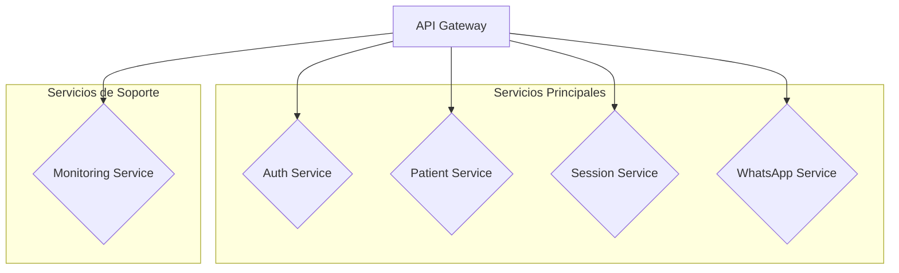

# 🚀 ROADMAP DE MEJORAS BACKEND - AIRA BOT

## Basado en Auditoría Crítica de Seguridad y Escalabilidad

---

## 🎯 OBJETIVO PRINCIPAL: Hacer que AIRA Bot sea **seguro, robusto y escalable** para 500+ profesionales, garantizando la **integridad y confidencialidad** de los datos médicos.

---

## 🗓️ FASE 1: ESTABILIZACIÓN Y SEGURIDAD CRÍTICA (Duración: 1-2 semanas)

### ✅ **Meta:** Mitigar riesgos de pérdida de datos y vulnerabilidades críticas. **NO USAR EN PRODUCCIÓN ANTES DE COMPLETAR ESTA FASE.**

| Prioridad | Tarea | Componente Afectado | Estado |
|---|---|---|---|
| 🔴 **CRÍTICA** | **Implementar Firestore Completamente** | `DatabaseManager` | `[ ] Sin Iniciar` |
| 🔴 **CRÍTICA** | **Generar y Usar Claves de Entorno Seguras** | `SecurityManager`, `.env` | `[ ] Sin Iniciar` |
| 🟠 **ALTA** | **Implementar Rate Limiting Global** | `Express Server` | `[ ] Sin Iniciar` |
| 🟠 **ALTA** | **Configurar Rotación de Logs** | `Winston Logger` | `[ ] Sin Iniciar` |
| 🟡 **MEDIA** | **Mejorar Validación de Inputs (SQLi/XSS)** | `SecurityManager` | `[ ] Sin Iniciar` |
| 🟡 **MEDIA** | **Crear Health Check Endpoint Detallado** | `Express Routes` | `[ ] Sin Iniciar` |

---

## 🗓️ FASE 2: REFACTORING Y OPTIMIZACIÓN (Duración: 2-4 semanas)

### ✅ **Meta:** Desacoplar la arquitectura monolítica, mejorar el rendimiento y sentar las bases para un crecimiento sostenible.

| Prioridad | Tarea | Componente Afectado | Estado |
|---|---|---|---|
| 🟠 **ALTA** | **Refactorizar `server.js` en Módulos** | `Toda la Arquitectura` | `[ ] Sin Iniciar` |
| 🟠 **ALTA** | **Implementar Pruebas Unitarias y de Integración** | `Jest/Mocha` | `[ ] Sin Iniciar` |
| 🟡 **MEDIA** | **Implementar Cache para Consultas Frecuentes** | `DatabaseManager`, `Redis` | `[ ] Sin Iniciar` |
| 🟡 **MEDIA** | **Optimizar Consultas a Firestore (Índices)** | `Firestore` | `[ ] Sin Iniciar` |
| 🟢 **BAJA** | **Documentar API Endpoints con Swagger/OpenAPI** | `Express Routes` | `[ ] Sin Iniciar` |

---

## 🗓️ FASE 3: FUNCIONALIDADES AVANZADAS Y ESCALABILIDAD A LARGO PLAZO (Duración: 1-2 meses)

### ✅ **Meta:** Añadir capas de seguridad avanzadas, mejorar la observabilidad y preparar el sistema para una mayor carga de usuarios.

| Prioridad | Tarea | Componente Afectado | Estado |
|---|---|---|---|
| 🟠 **ALTA** | **Implementar Autenticación de 2 Factores (2FA)** | `SecurityManager` | `[ ] Sin Iniciar` |
| 🟡 **MEDIA** | **Crear Dashboard de Monitoreo de Métricas** | `Prometheus/Grafana` | `[ ] Sin Iniciar` |
| 🟡 **MEDIA** | **Implementar Sistema de Backups Automatizados** | `Firestore`, `Cloud Storage` | `[ ] Sin Iniciar` |
| 🟢 **BAJA** | **Optimizar Prompts y Costos de Gemini API** | `AIServices` | `[ ] Sin Iniciar` |
| 🟢 **BAJA** | **Persistir Conversaciones de WhatsApp** | `WhatsAppBot`, `Firestore` | `[ ] Sin Iniciar` |

---

## 💡 ARQUITECTURA OBJETIVO

**Próximos Pasos:**
1. **Aprobar este roadmap.**
2. **Comenzar con la Tarea 1 de la FASE 1: Implementar Firestore.**
